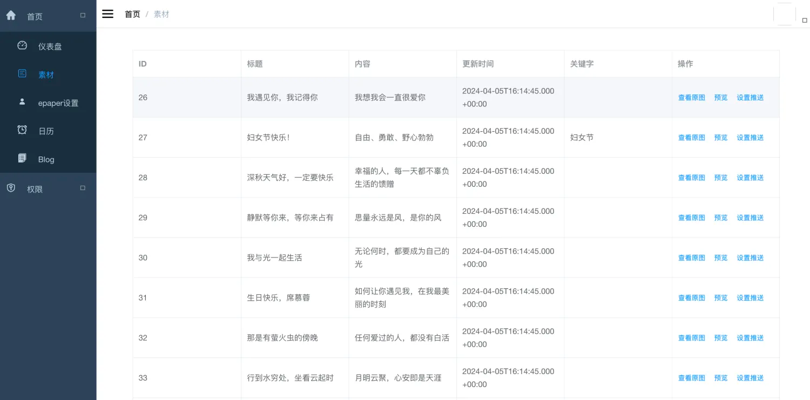
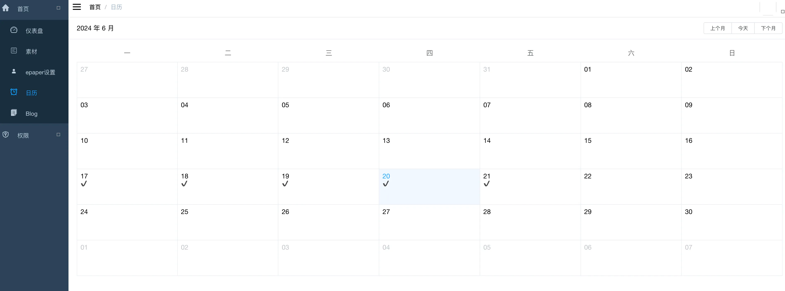
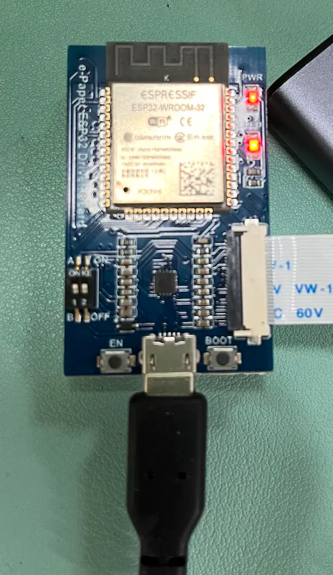
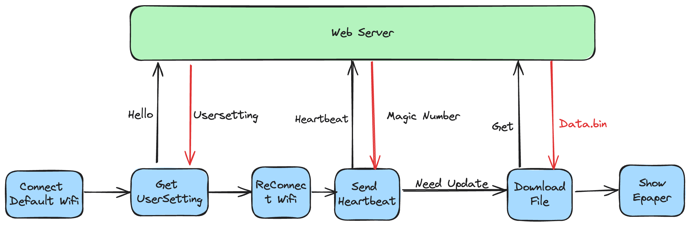
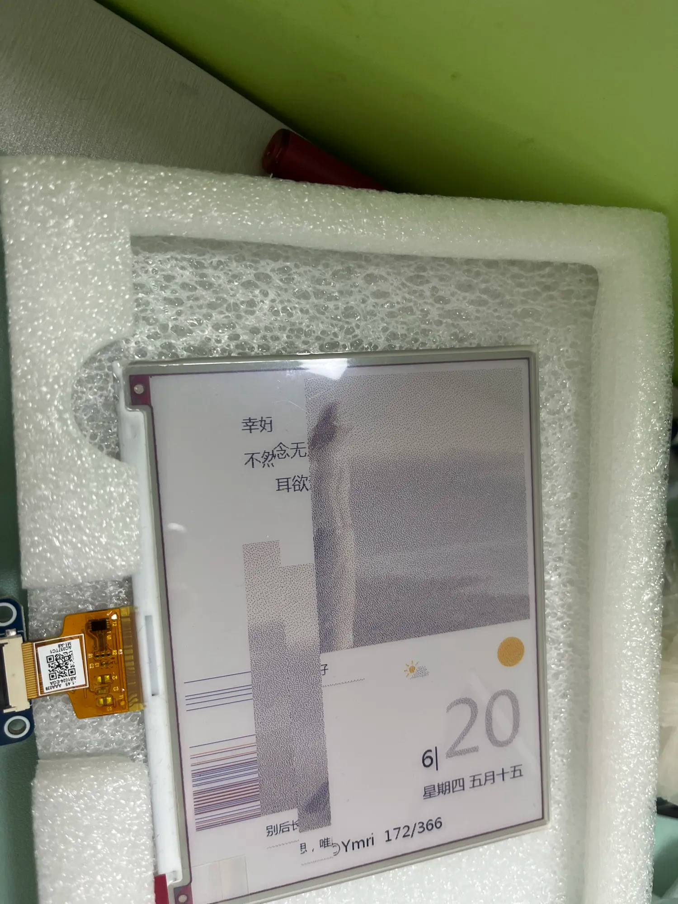

# esp32_7color
感谢[少数派凉糕的创意](https://sspai.com/post/82704), 本来打算能跑就行，然后断断续续填坑，在实现凉糕的创意的基础上添加通用的web管理。

esp32-5.65inch-7color-epaper，后台管理端+esp32端
设备需要：
* ESP32 开发部件，个人和5.65inch都是在官方平台购买
* 服务器一台，运行后端（运行java+mysql+nginx）

页面设计，我尽力了.....，不过一张图片的事，直接收集日历设计还原就是。

## 一、系统设计

主要分两个个部分：

- [x] Web端，负责远程生成当天的Epaper
- [x] ESP32端，负责显示Epaper

### Web端

主要由Java改编[mall-admin-web](https://github.com/macrozheng/mall-admin-web)项目（本来想用Go，发现还是java手搓快， 233），mall-admin-web需要配合sql使用，为了方便维护我直接购买的阿里云MySQL，数据直接即可导入。
爬虫和图片合成以及图片转换使用python实现，详细见仓库的`python`部分。

Web可以进行的操作如下：

1. **设置esp32连接WIFI和password**

2. **素材管理、查看、设置推送**

根据需要选择每天的推送内容，目前只能在数据库选择（后续添加用户上传数据）

3. **查看推送日历**

因为Web端操作比较简单，而且JAVA代码主题和mall-web-admin 几乎无异，不在过多解释。

#### 数据收集

主要素材来自为你读诗公众号，对封面图和推送标题进行爬取。项目参考：

#### 素材合成

#### 图片转化

bmp图片转换输出为二进制的`bin`文件，其实就是把原本保存的二进制数组二进制保存，[官方提供的源码修改](https://www.waveshare.net/wiki/5.65inch_e-Paper_Module_(F)_Manual#.E5.9B.BE.E7.89.87.E6.95.B0.E6.8D.AE.E8.BD.AC.E6.8D.A2)
详细见仓库的`./coverImg`

#### 接口编写

### ESP32 端

ESP32端，采取远程下载服务端处理好的二进制数据(就是一个数组)保存到SPIFFS下的`\data.bin`，然后本地读取渲染，加上最开始的配置读取，ESP32端一共需要向服务发送3个请求，亮红灯表明wifi正常连接。

ESP32端系统流程图如下

**代码重要函数作用如下**

- [x] initConfig()：初始化配置(连接默认热点)
- [x] http_get_task(): 获得用户设置
- [x] initConfig(): 包括了重新连接Wifi
- [x] http_heartbeat(): 发送心跳，获得魔法数字，并且对比是否需要更新
- [x] downloadAndSaveFile(): 下载文件并保存
- [x] loadDataBin(): 加载二进制文件，并且显示
- [x] cleanData()：清除本轮垃圾

#### 使用提醒

- 设置初始化wifi，是因为考虑到用户搬家或者其他因素，所以允许用户先打开热点然后连接上一个固定的Wifi。如果支持的话，提前烧录好效果最佳。
- 由于莫名情况，有几率出现显示异常，异常如下所示，正常情况重新刷新就好了，还未完全解决，因此希望尽可能避免“提醒1”的情况，最好提前烧录进去。

#### 开发提醒

- 请先查看官方文档，再提问。
- 远古的mirc-usb线，记得找能传输数据的，不然你会在第一步卡死.....
- 运行过程一直被看门狗给强行中断，所以把所有操作全部放到`loop`里面。

异常如下所示：

> Task watchdog got triggered. The following tasks did not reset the watchdog in time:

尝试过把分解成3个依旧没办法避免被看门狗杀掉，三个任务基本都是以长时间IO，导致CPU处于饥饿，最后被看门狗杀。索性把任务全部丢到loop里面，然后定时休眠循环更新。（写web的脑子想的是如何让轻量级人任务定时后台触发....别喷）

- epaper显示问题

在【参考资料3】中使用的是每个点都读取文件然后显示，然后一张图片半个小时还没刷新完成，修改成每次读取一行，然后直接显示。具体看代码

#### ESP32 参考资料

1. 基础官方文档：[https://www.waveshare.net/wiki/5.65inch_e-Paper_Module_(F)_Manual#.E5.9B.BE.E7.89.87.E5.A4.84.E7.90.86](https://www.waveshare.net/wiki/5.65inch_e-Paper_Module_(F)_Manual#.E5.9B.BE.E7.89.87.E5.A4.84.E7.90.86)
2. esp32版官方文档(本项目在wifi版基础上进行修改)：[https://www.waveshare.net/wiki/E-Paper_ESP32_Driver_Board#.E4.B8.B2.E5.8F.A3.E9.A9.B1.E5.8A.A8](https://www.waveshare.net/wiki/E-Paper_ESP32_Driver_Board#.E4.B8.B2.E5.8F.A3.E9.A9.B1.E5.8A.A8)
3. [https://github.com/kc1r74p/ReadMePaper](https://github.com/kc1r74p/ReadMePaper)：ESP32 - ePaper 7 Color project (借鉴使用SPIFFS保存文件)