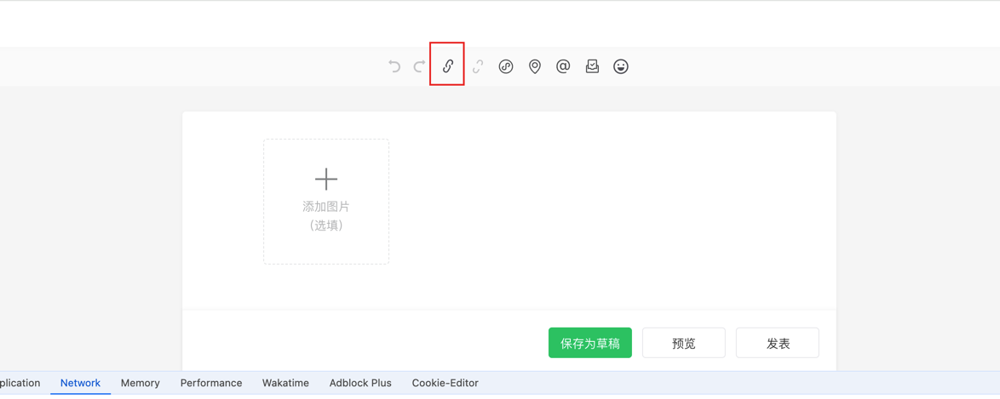
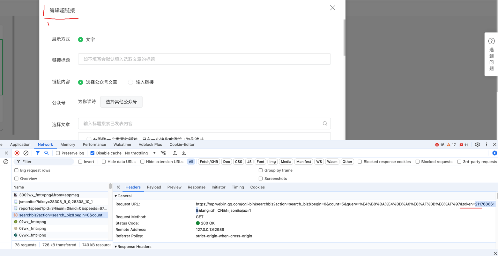
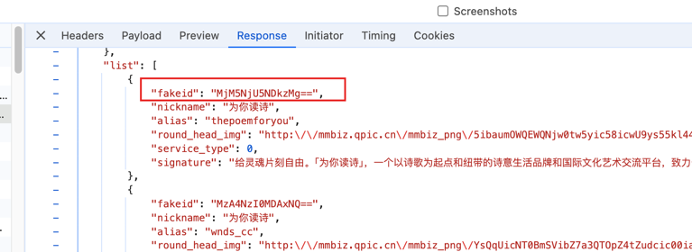

# spider 部分

下载依赖`pip install -r requirements.txt` 

目前数据全部来自公众号为你读书，项目借鉴：https://github.com/SiyuanLi-Sven/WechatOfficialAccountSpider

我们只需要申请一个公众号，然后获得3个参数：Cookie、token、fakeid（表示哪个公众号）

使用DataClear 对数据进行清洗并且下载图片，图片以标题+内容的形式呈现（注意不可见字符....）

个人简单清洗后使用SqlUtils存储到数据库中.

提醒：
* 大概爬200个左右就会被系统封了，需要过1-2天再继续爬....

点击编辑文章， 然后选择编辑超链接

找到token以及下面的Cookie

具体百度~~